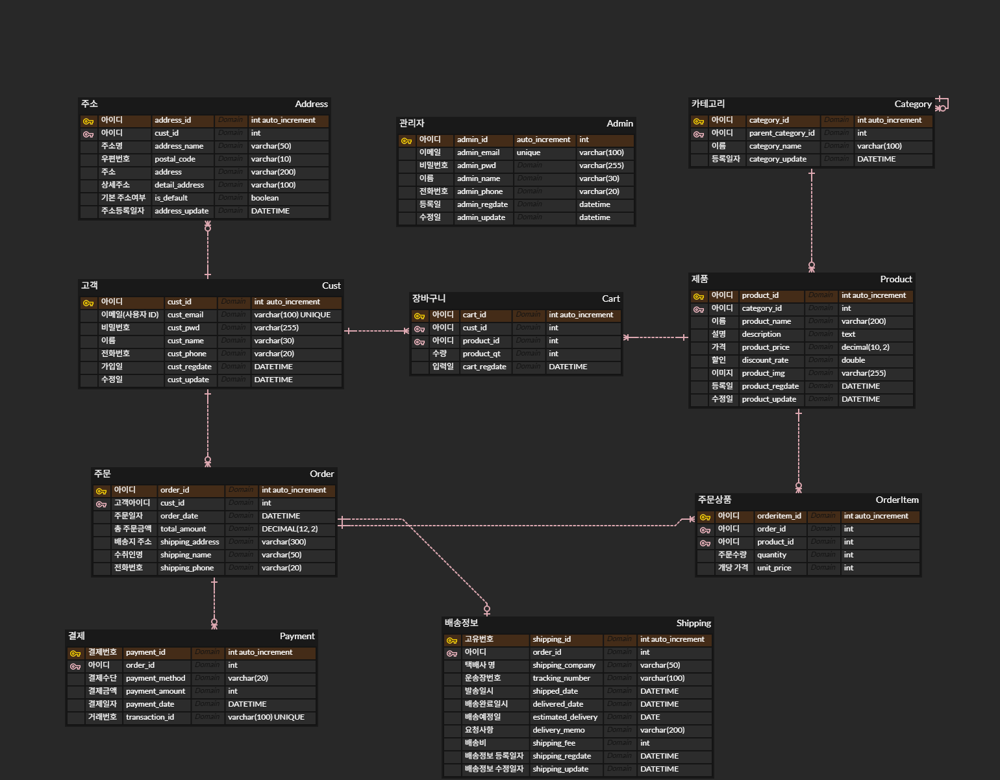
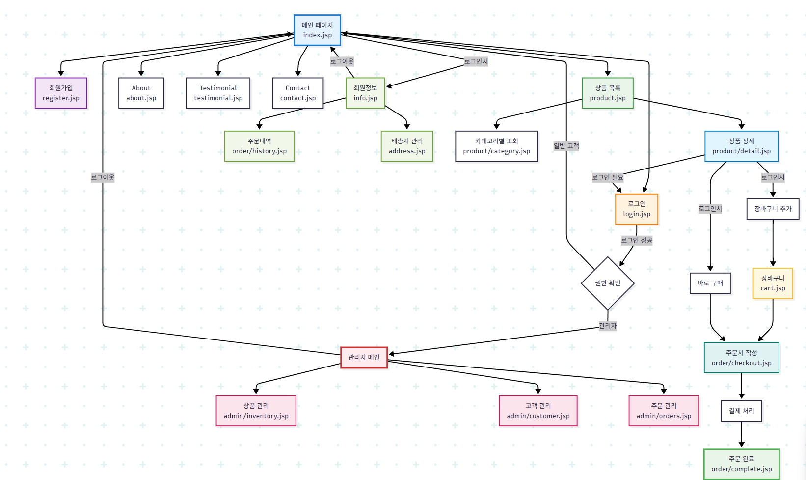
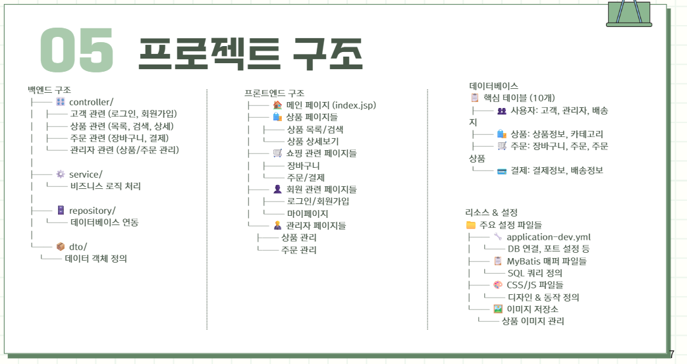
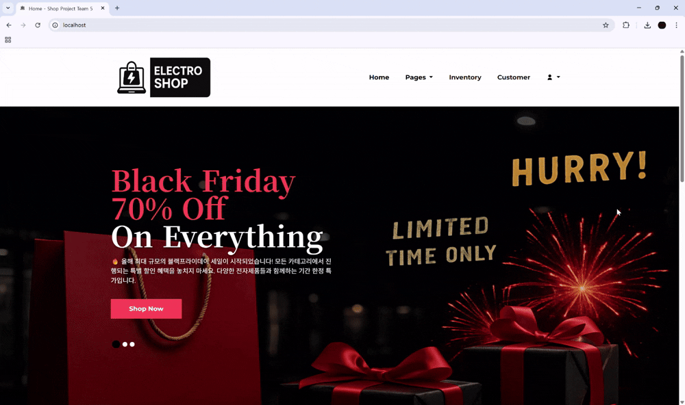
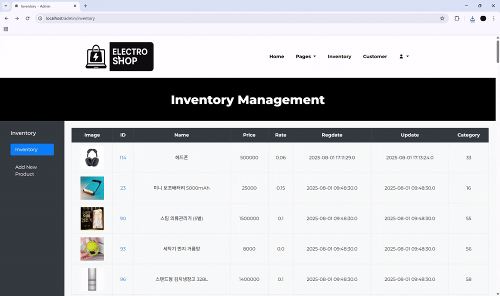
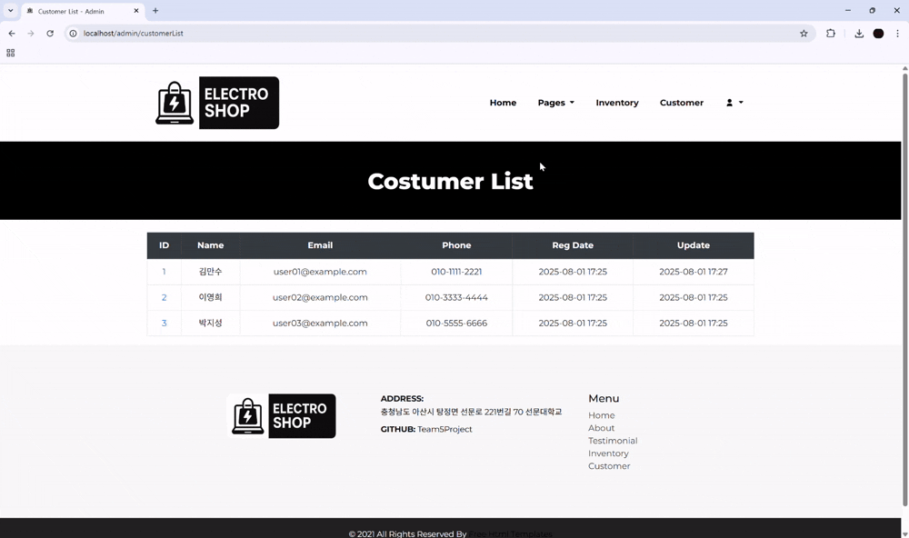
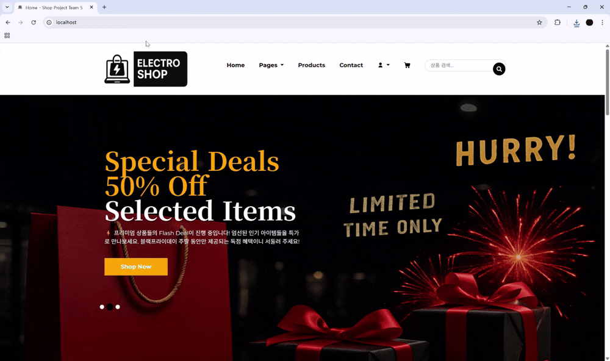

### 🧑‍💻TEAM 5 - 프로젝트명 : Spring Boot 기반 전자제품 쇼핑몰 
***
# 🎯 주제
  -  Spring Boot와 JSP를 활용하여 구축되는 전자제품 쇼핑몰 
  -  관리자 시스템, 고객 관리, 상품 관리, 주문 처리, 배송 관리 등의 핵심 기능을 제공하는  웹 애플리케이션
***
# ⌛개발 기간
- 25.07.21 ~ 25.07.31
***
# 🕺구성원/역할
1. 주민성(Rediaum)          <https://github.com/Rediaum>
- PM

2. 주희성(jhs0106)        <https://github.com/jhs0106> 
- PL&PM(sub)

3. 라마단 비에리(vieri)          <https://github.com/vieri4643>
- DEV
***
# 주요기능
- 회원가입 및 로그인
- 상품 목록 조회(카테고리별 조회)
- 장바구니 추가/삭제/수량 변경
- 고객 주문 및 결제
- 관리자 상품 등록/수정/삭제 기능
- 주문 내역 확인 및 주문 상품 관리
- 고객 주소지(배송지) 관리
***
# 🛠️기술 스택

  ### ⚙️ 백엔드
    - ☕ Java
    - 🌱 Spring Boot
    - 🧩 MyBatis
    - 🛢️ MySQL
  
  ### 💻 프론트 엔드
    - 📄 JSP
    - 🧱 HTML5, 🎨 CSS3
    - ✨ JavaScript, ⚡ Ajax, 💫 jQuery
    - 🎀 Bootstrap

  ### 🧰 개발도구
    - 🧠 IntelliJ IDEA
    - Gradle

  ### 🔗협업도구
    - Git & GitHub
    - ERDCloud
    - 📒 Notion
    - 💬 Slack
  ### 📦 Others
    - 💡 다양한 라이브러리 및 플러그인 적용
***    
### 🗂️ ERD
 
### 🗂️ DDL
https://www.notion.so/erd-ddl-238fe5d709bc80bd90dcfe2b4614ebf0?source=copy_link
### 🗂️ DML
https://www.notion.so/DML-239fe5d709bc80ab8bc7f5d57af3c7e4?source=copy_link  -- 샘플 DML
***
### 화면 흐름도

### 🗂️ Based on Template
https://themewagon.com/themes/famms-free-responsive-bootstrap-4-e-commerce-website-template/
***
# 프로젝트 구조

***
# 기능별 gif
### 회원가입 & 로그인(주문 페이지 적용 전)

### 상품 카테고리 별 조회 

### 장바구니 추가/삭제/수량 변경

### 고객 주문 및 결제 + 배송 정보 등록
#### - 바로 결제 + 배송 정보 등록

#### - 카트에서 결제

### 관리자 기능(상품 등록/수정/삭제, 고객 수정/삭제)

#### -상품 등록

#### -상품 수정

#### -상품 삭제

#### -고객 수정

#### -고객 삭제

### 주문 내역 확인 및 주문 상품 관리

### 고객 주소지(배송지) 관리

### 검색 기능
